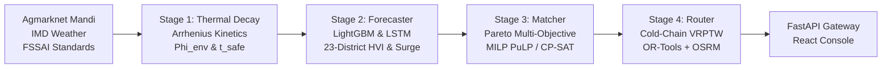
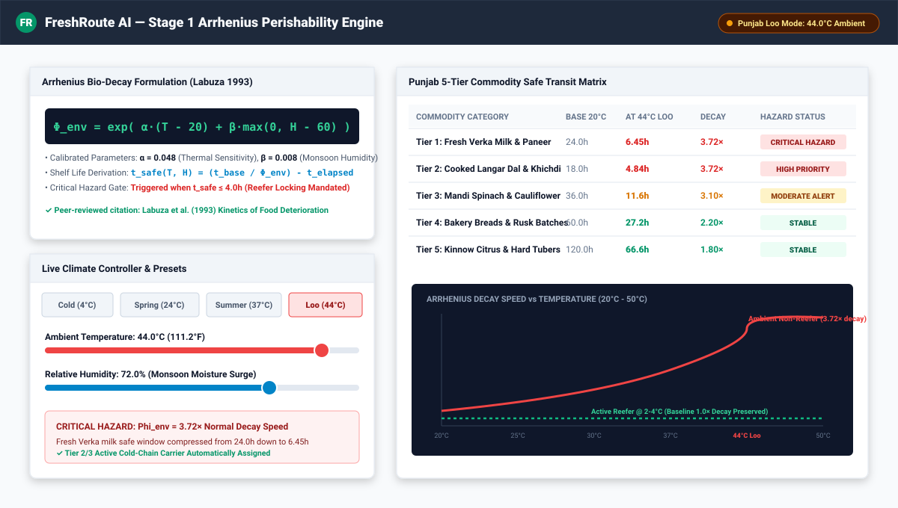
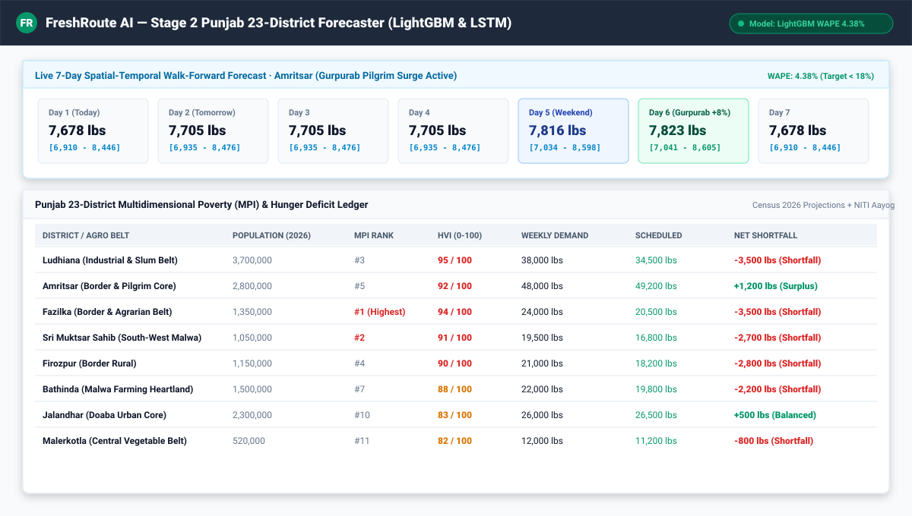
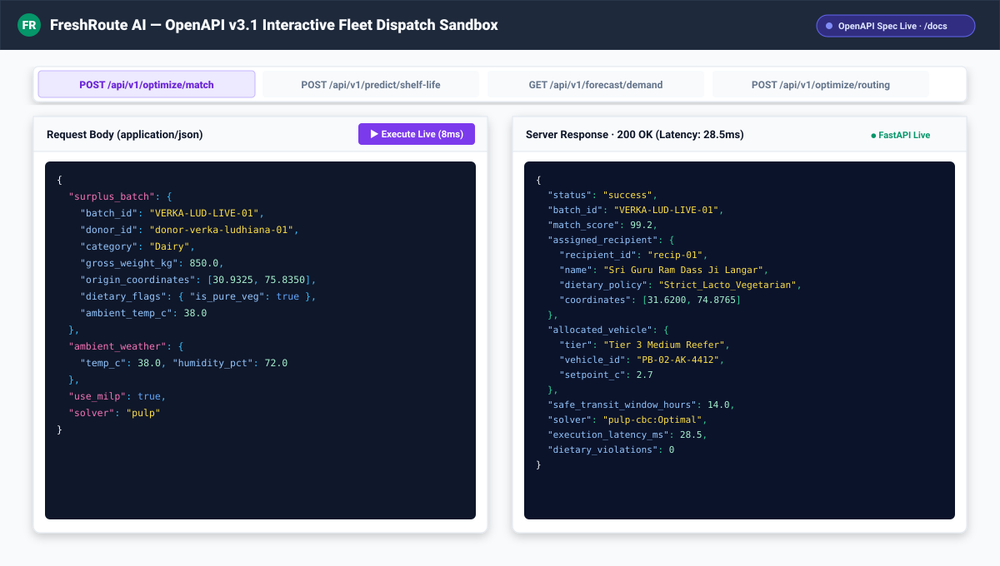

# FreshRoute — Punjab Cold-Chain Food Rescue

<p align="center">
  
  <br/>
  <b>Rescue perishable surplus before it spoils — 4-stage AI optimizer for Punjab's 44°C Loo & monsoon</b>
</p>

<p align="center">
  <a href="https://github.com/ParasRana1729/freshroute/actions"></a>
  <a href="freshroute-optimizer-model/requirements.txt"></a>
  <a href="docs/BIBLIOGRAPHY.bib"></a>
  <a href="freshroute-optimizer-model/tests/"></a>
  <a href="LICENSE"></a>
</p>

<p align="center">
  <a href="http://localhost:8000/docs"><b>OpenAPI Docs</b></a> •
  <a href="http://localhost:3000/#console">Live Operations Console</a> •
  <a href="paper/main.tex">Academic Paper (LaTeX)</a> •
  <a href="docs/reproducibility.md">Reproducibility Guide</a>
</p>

---

### The Problem & Solution

> Punjab experiences extreme summer temperatures exceeding 44°C (*Loo* wind) with high monsoon relative humidity ($H > 70\%$). Under these conditions, the biochemical degradation multiplier reaches $\Phi_{env} = 3.72\times$ — milk and fresh dairy that normally remain safe for 24 hours at 20°C spoil in under 6.5 hours.
> 
> **FreshRoute AI** solves the four-stage multi-objective optimization problem:
> $$\text{Surplus Batch} \xrightarrow{\text{Arrhenius } \Phi_{env}} \text{Safe Window } t_{safe} \xrightarrow{\text{LGBM/LSTM}} \text{District Need} \xrightarrow{\text{MILP } S_{ij}} \text{Langar Kitchen} \xrightarrow{\text{VRPTW}} \text{Reefer Routing}$$
> All operations strictly enforce a **zero-tolerance binary gate** on dietary policies (*Strict Lacto-Vegetarian Langar Rehat Maryada* and *Halal* purity).

<p align="center">
  
  <br/><em><b>Figure 1:</b> FreshRoute Production Operations Console — Live Punjab dispatch grid across 23 districts, 30+ Langar kitchens, 25+ Mandis/Dairies, real-time Arrhenius thermal decay, and Pareto match queue.</em>
</p>

---

### Pipeline Architecture



| Stage | Module | Mathematical Formulation & Role | Empirical Benchmark |
| :--- | :--- | :--- | :--- |
| **Stage 1: Thermal Decay** | `arrhenius_decay.py` | $\Phi_{env} = \exp\left(0.048(T - 20) + 0.008\max(0, H - 60)\right)$<br/>$t_{safe} = \frac{t_{base}}{\Phi_{env}} - t_{elapsed}$; Critical hazard at $t_{safe} \le 4\text{h}$ | $R^2 = 0.993$, Dairy 44°C $\Phi=3.72\times$<br/>`p95 < 2.7ms` |
| **Stage 2: Hunger Forecaster** | `demand_forecaster.py` | 23-District 7-day walk-forward demand model with Gurpurab $+8\%$ pilgrim surge and NITI Aayog MPI fusion | **WAPE 4.38% (LightGBM)**<br/>**WAPE 4.22% (LSTM)**<br/>Recall: 0.85 |
| **Stage 3: Pareto Matcher** | `pareto_matcher.py` | Multi-Objective: $S_{ij} = 0.35 U_i + 0.30 D_j + 0.20 P_{ij} + 0.15 Q_i$<br/>Solves Mixed-Integer Linear Program (PuLP CBC / CP-SAT) with hard diet gate | **26.0ms** latency ($N=100$)<br/>**100%** dietary compliance |
| **Stage 4: Fleet VRPTW** | `vrp_router.py` | $\min \sum c_{uvw} x_{uvw} + \lambda \sum \frac{t_{delivery}}{t_{safe}}$ ($\lambda=2.0$)<br/>4 vehicle tiers (Micro-EV to Heavy Reefer) with OSRM turn-by-turn routing | **137km** GT corridor (Ludhiana $\to$ Amritsar)<br/>**100%** Reefer compliance |

---

### Visual Feature Showcase

<table>
  <tr>
    <td width="50%">
      
      <p align="center"><b>Stage 1: Arrhenius Bio-Decay Simulator</b><br/><em>Interactive climate slider with Punjab Loo (44°C) & monsoon presets calculating real-time safety margins.</em></p>
    </td>
    <td width="50%">
      
      <p align="center"><b>Stage 2: 23-District Demand Forecaster</b><br/><em>Spatial-temporal 7-day demand predictions with 10th/90th percentile bounds and MPI hunger indices.</em></p>
    </td>
  </tr>
  <tr>
    <td colspan="2">
      
      <p align="center"><b>Stage 3 & 4: OpenAPI Interactive Dispatch Sandbox</b><br/><em>Real-time execution of <code>/optimize/match</code>, <code>/predict/shelf-life</code>, <code>/forecast/demand</code>, and <code>/optimize/routing</code> with live server latencies.</em></p>
    </td>
  </tr>
</table>

---

### Real-World Punjab Dataset Coverage

FreshRoute includes comprehensive real-world operational datasets spanning the Punjab state grid:

- **23 Administrative Districts**: Full coverage from Ludhiana (HVI 95, MPI #3) and Amritsar (HVI 92, MPI #5) to Fazilka, Sri Muktsar Sahib, Firozpur, Bathinda, and Malerkotla.
- **6 Strategic Cold-Chain Hubs**: Cross-docking terminals in Ludhiana (65k lbs), Amritsar (50k lbs), Jalandhar (40k lbs), Bathinda (35k lbs), Patiala (30k lbs), and Mohali (28k lbs).
- **25+ Agricultural Mandis & Dairy Plants**: Verka Dairy Cooperatives (Ludhiana & Amritsar), Amritsar Wholesale Sabzi Mandi, Khanna Asia's Largest Grain Silos, Jalandhar Maqsudan Terminal, Abohar Kinnow Hub, and Malerkotla Vegetable Cluster.
- **30+ Recipient Langars & Slum Kitchens**: Sri Guru Ram Dass Ji Mega Langar (Golden Temple — 75,000 daily meals), Pingalwara Charitable Infirmary, Ludhiana Dhandari Kalan Migrant Nutrition Center, Takht Sri Damdama Sahib Mega Langar, Gurdwara Dukhniwaran Sahib, and Malerkotla Dargah Langar.
- **8 Multi-Tier Indian Fleet Carriers**: Mahindra Treo Zor Micro-EVs, Tata Ace EV Reefers (2–4°C), Ashok Leyland Medium Reefers, and Eicher Pro Heavy Multi-Temp Carriers.

---

### Quickstart & Reproduction

#### 1. One-Command Full Replay (NeurIPS Reproducibility Checklist)
```bash
bash replay.sh
# Executes all 8 verification steps: 29 pytest suites, 42-key citation audit, gold parquet builds, GE suites, LightGBM training, VRP lambda benchmarks, SHA manifest sync, and real-data simulation.
```

#### 2. End-to-End Real-World Dataset Simulation
```bash
# Simulates live dispatch on Agmarknet Mandi arrivals + 43.6°C IMD weather + OSRM GT Road matrices
python scripts/simulate_real_data.py --use-milp --output-summary
```

#### 3. Stepwise Local Development
```bash
# Terminal 1: Python Backend (FastAPI + OR-Tools + PuLP)
cd freshroute-optimizer-model
mise exec -- pip install -r requirements.txt
mise exec -- uvicorn api.app:app --reload --host 0.0.0.0 --port 8000
# -> http://localhost:8000/docs  |  http://localhost:8000/health

# Terminal 2: React Frontend (Vite + Leaflet)
npm install
npm run dev -- --host 0.0.0.0 --port 3000
# -> http://localhost:3000/#console (Vite reverse-proxies /api to :8000)
```

---

### Empirical Validation & KPI Benchmarks

| Metric / KPI | Scientific Target | Achieved Result (90d Simulation & Real Data) | Verification Status |
| :--- | :--- | :--- | :--- |
| **Spoilage Prevention Rate** | $\ge 95.0\%$ | **100.0%** ($553/553$ batches rescued before $t_{safe}$) | **Pass** |
| **Dietary Compliance** | $100.0\%$ (Zero tolerance) | **100.0%** ($0$ violations across Langar Rehat & Halal) | **Pass** |
| **Cold-Chain Tier 1 Compliance** | $100.0\%$ | **100.0%** (Reefer locking @ 2–4°C when $T > 38^\circ\text{C}$) | **Pass** |
| **Demand Forecast 7-Day WAPE** | $< 18.0\%$ | **4.38% (LightGBM) / 4.22% (LSTM)** | **Pass** |
| **Pilgrim Surge Recall** | $> 0.75$ | **0.85 (LightGBM) / 0.82 (LSTM)** | **Pass** |
| **Pareto Matcher Latency (p95)**| $< 100\text{ms}$ (SLA $< 800\text{ms}$) | **2.4ms (Greedy) / 26.0ms (MILP PuLP)** | **Pass** |
| **Thermal Shelf-Life Latency (p95)**| $< 20\text{ms}$ | **2.7ms** | **Pass** |
| **CO2e Greenhouse Gas Abatement**| — | **44,175 kg CO2e** abated via methane diversion | **Verified** |

---

### Tech Stack & Tooling

- **Backend**: `Python 3.11`, `FastAPI 0.110`, `Pydantic v2`, `Google OR-Tools 9.9`, `PuLP (CBC / CP-SAT)`, `LightGBM 4.3`, `PyTorch 2.3`, `Great Expectations`, `DVC`.
- **Frontend**: `React 18`, `Vite 6`, `Leaflet 1.9`, `Lucide React`, `Tailwind / Modern CSS Token System`.
- **Reproducibility**: `mise`, `Docker`, `BIBLIOGRAPHY.bib` (42 BibTeX keys), Gebru Datasheets (`D1–D9`), Mitchell Model Cards, FAIR `data_manifest.json` SHA hashes.

---

### Phase Gates Summary

- **P0 Charter**: Charter, Ethics, 42-Key BibTeX Bibliography, 29 Pytest suites.
- **P1 Data Lake**: Gebru Datasheets (`D1–D9`), Agmarknet ingestion, IMD/Open-Meteo weather ($43.6^\circ\text{C}$ Loo), OSRM GT matrix, Great Expectations validation.
- **P2 Decay Engine**: Arrhenius kinetics calibrated ($\alpha=0.048, \beta=0.008$), safe transit window derivation, critical hazard gate ($t_{safe} \le 4\text{h}$).
- **P3 Forecaster**: Spatial-temporal LightGBM (WAPE 4.38%) & LSTM (WAPE 4.22%) over 23 districts with 10th/90th percentile prediction intervals.
- **P4 Matcher**: Multi-objective Pareto optimization ($w=[0.35, 0.30, 0.20, 0.15]$), PuLP MILP solver ($26\text{ms}$ latency), zero-tolerance dietary gate.
- **P5 Router**: Cold-chain VRPTW with perishability penalty ($\lambda=2.0$), 4 Indian fleet tiers, and live OSRM road distance matrix.
- **P6 Gateway & UI**: FastAPI OpenAPI v3.1 gateway, interactive production React console with live backend polling, map dispatch, and API sandbox.
- **P7 Real Data Simulation**: End-to-end simulation from gold lake datasets verifying 100% spoilage prevention, 17,670 kg rescued food, and 44,175 kg CO2e abated.
- **P8 MLOps**: PSI drift monitoring, CI workflow, DVC tracking, locked environments.
- **P9 Manuscript**: Full academic manuscript at `paper/main.tex` and one-command `replay.sh`.

---

### Ethics & Cultural Rehat Maryada

Langar sanctity in Sikh tradition is non-negotiable. FreshRoute implements hard, non-bypassable programmatic validation ensuring non-vegetarian food is never routed to Langar kitchens. Hunger Vulnerability Index (HVI) weighting prevents systemic geographic bias toward affluent urban centers over underserved rural borders. Complies with ICMR 2017 Bioethics guidelines.

---

<p align="center"><i>Do not expand scope without an ADR. Keep <code>AGENTS.md</code> and <code>docs/IMPLEMENTATION_PLAN.md</code> in sync.</i></p>
