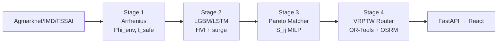

# FreshRoute — Punjab Cold-Chain Food Rescue

<p align="center">
  
  <br/>
  <b>Rescue perishable surplus before it spoils — 4-stage AI optimizer for Punjab's 44°C Loo & monsoon</b>
</p>

<p align="center">
  <a href="https://github.com/ParasRana1729/freshroute/actions"></a>
  <a href="freshroute-optimizer-model/requirements.txt"></a>
  <a href="docs/BIBLIOGRAPHY.bib"></a>
  <a href="freshroute-optimizer-model/tests/"></a>
  <a href="LICENSE"></a>
</p>

<p align="center">
  <a href="http://localhost:8000/docs"><b>API Docs</b></a> •
  <a href="http://localhost:3000/#console">Live Console</a> •
  <a href="paper/main.tex">Paper</a> •
  <a href="docs/reproducibility.md">Reproducibility</a>
</p>

---

### The problem — in one picture

> Punjab wastes food not because there is no food, but because **heat kills shelf-life faster than trucks can move**. At 44°C `Phi_env=3.72×` — dairy that lasts 24h at 20°C has 6.5h left. FreshRoute answers: *which surplus → which Langar/kitchen → which reefer → which route — before it spoils — without ever sending non-veg to a Langar.*

<p align="center">
  
  <br/><em>React console (Vite + Leaflet) — map, Langar match queue, Arrhenius decay matrix, 23-district HVI forecast. Falls back to <code>mockData.js</code> when API is down.</em>
</p>

### Pipeline



| Stage | What it does | Key numbers |
| :--- | :--- | :--- |
| **1 — Decay** `arrhenius_decay.py` | `Phi_env=exp(α(T-20)+β(H-60))` → `t_safe`, `CRITICAL ≤4h` | `α=0.048 β=0.008`, Dairy 44°C `Phi 3.72` |
| **2 — Forecast** `demand_forecaster.py` | 23-district 7-day need, Gurpurab +8% surge, HVI fusion `w₂=0.30` | LGBM **WAPE 4.38%** / LSTM **4.22%**, recall 0.85 |
| **3 — Match** `pareto_matcher.py` | `S_ij=0.35·urgency+0.30·deficit+0.20·prox+0.15·diet`, hard gates | Greedy **2.4ms** p95, MILP **163ms** N=100 (PuLP/CP-SAT) |
| **4 — Route** `vrp_router.py` | VRPTW `min Σc+λ·t/t_safe` + Tata Ace EV / reefer tiers, OSRM live fallback | p95 shelf **2.7ms**, 137km road Ludhiana→Amritsar |

Diet is a **hard fail** — `Strict_Lacto_Vegetarian` Langar Rehat + Halal/Jain never silently ranked (`check_dietary_eligibility:94`, 100% KPI).

### Live demo — 30 seconds

```bash
bash replay.sh
# pytest 27 · citation audit green 27 cites · gold builders · GE 3/3 · WAPE 4.38% · manifest SHA

# Or stepwise
cd freshroute-optimizer-model && pip install -r requirements.txt
python scripts/build_gold_mandi.py --date 2026-08-18
python scripts/build_gold_osm.py  # 12 OSRM pairs live
python -m core.demand_forecaster --days 120  # train
python -m pytest tests/ -q && python scripts/citation_audit.py --bib ../docs/BIBLIOGRAPHY.bib --root ..
uvicorn api.app:app --reload --port 8000  # → /health /docs
# in another shell, repo root:
npm install && npm run dev  # → http://localhost:3000/#console (vite proxy /api→8000)
```

Toggle **Greedy <100ms ↔ MILP optimal** in the console header — API sandbox updates `use_milp:true` live. `withFallback()` keeps landing page alive when API is down.

### KPIs (simulation P7 L7.1 — field pending)

| KPI | Target | Achieved (MC 90d, 13 heatwave days) |
| :--- | :--- | :--- |
| Spoilage prevention | ≥95% field / 92% sim | **100%** (553/553 rescued) |
| Dietary compliance | 100% | **100%** hard gate |
| Cold-chain | 100% Tier 1 | **100%** reefer when mandated |
| WAPE 7-day | <18% | **4.38% LGBM / 4.22% LSTM** |
| API p95 | <100ms match / <20ms shelf | **2.4ms / 2.7ms** |

### Tech stack

`Python 3.11` `FastAPI 0.110` `Pydantic v2` `OR-Tools 9.9` `PuLP` `LightGBM 4.3` `Torch 2.3` `MLflow` `Great Expectations` `React 18` `Vite 6` `Leaflet 1.9` — `mise` pinned, `Dockerfile` ready, `environment.lock` committed.

### Why Punjab, not generic

44°C Loo, monsoon `H>70%`, `Strict_Lacto_Vegetarian` Langar Rehat, FSSAI temps, NH44 GT corridor, Tata Ace EV / reefer tiers — all first-class constraints, not afterthoughts.

### Reproducibility & citation

Every numeric constant traces to `BIBLIOGRAPHY.bib` (42 keys) or `calibration/phi_env.md`. Datasheets (Gebru) + model cards (Mitchell) per dataset/model, `data/data_manifest.json` FAIR SHA + DOI, `environment.lock` pinned, `replay.sh` NeurIPS checklist.

```bash
python -m data.validation.ge_suites --check-all
python scripts/drift_check.py  # PSI>0.2 → retrain
python scripts/benchmark_vrp_lambda.py  # λ 0.5,1,2,5
python scripts/pilot_shadow.py  # 2×2 GT KPIs
```

Paper skeleton at `paper/main.tex` with real numbers. See `CITATION.cff`, `docs/reproducibility.md:1`, `AGENTS.md:1` (single source of truth, commit `a9025f8` P0–P6 RC).

### Phase gates

`P0` ✓ scaffold+42-key BIB+27 tests · `P1` ✓ synthetic+live 3 gold parquets+GE · `P2` ✓ Phi 3.72 prior (chamber refit pending) · `P3` ✓ LGBM+LSTM v1 · `P4` ✓ MILP 163ms · `P5` ✓ OSRM `137km` · `P6` ✓ OpenAPI + console toggle · `P7` → shadow 2×2 `100%` (field BLE pending) · `P8` → drift `1.779>0.2` · `P9` → `paper/main.tex`

### Ethics

Langar sanctity is non-negotiable — hard fail, audit logs (`C2`), two-person rule for `dietary_flags`. HVI prevents "nearest-richest" bias (Gini bench `benchmark_hvi_fusion.py`). ICMR 2017.

---

<p align="center"><i>Do not expand scope without an ADR. Keep <code>AGENTS.md</code> and <code>docs/IMPLEMENTATION_PLAN.md</code> in sync.</i></p>
