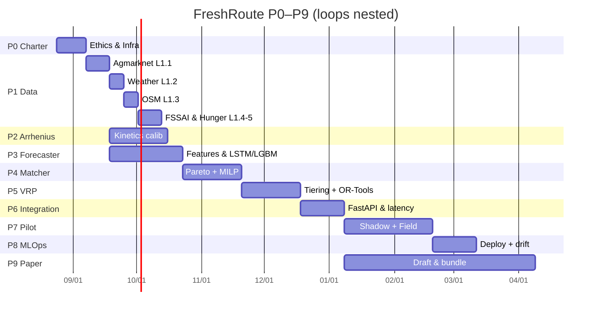

# Gantt — FreshRoute Implementation (32 weeks)

```mermaid
gantt
    title FreshRoute P0–P9 (loops nested)
    dateFormat  YYYY-MM-DD
    axisFormat  %m/%d
    section P0 Charter
    Ethics & Infra           :p0, 2026-08-24, 14d
    section P1 Data
    Agmarknet L1.1           :p1a, after p0, 11d
    Weather L1.2             :p1b, after p1a, 7d
    OSM L1.3                 :p1c, after p1b, 7d
    FSSAI & Hunger L1.4-5    :p1d, after p1c, 11d
    section P2 Arrhenius
    Kinetics calib           :p2, after p1a, 28d
    section P3 Forecaster
    Features & LSTM/LGBM     :p3, after p1a, 35d
    section P4 Matcher
    Pareto + MILP            :p4, after p3, 28d
    section P5 VRP
    Tiering + OR-Tools       :p5, after p4, 28d
    section P6 Integration
    FastAPI & latency        :p6, after p5, 21d
    section P7 Pilot
    Shadow + Field           :p7, after p6, 42d
    section P8 MLOps
    Deploy + drift           :p8, after p7, 21d
    section P9 Paper
    Draft & bundle           :p9, after p6, 91d
```

Update at each outer gate; source of truth is `docs/IMPLEMENTATION_PLAN.md:11`.
